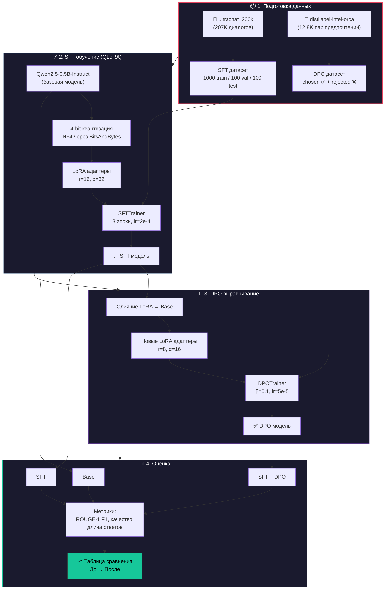

# 🧬 Файнтюнинг с LoRA и DPO

Пайплайн тонкой настройки языковой модели **Qwen2.5-0.5B-Instruct** с использованием **QLoRA** (4-битная квантизация + LoRA-адаптеры) и выравнивание через **DPO (Direct Preference Optimization)** для повышения качества ответов.

**Сложность:** ⭐⭐⭐⭐ (Senior) — Проект требует понимания работы LLM, квантизации (QLoRA), выравнивания моделей (RLHF/DPO) и архитектуры GPU (CUDA).

> Проект #4 из видео [5 AI Engineer Projects to Build in 2026](https://www.youtube.com/watch?v=9WIsvEswZTk) — Aishwarya Srinivasan (ex-Google, Microsoft).

---

## 📊 Диаграмма архитектуры (Mermaid)



---

## 📂 Структура проекта

```
├── config.py             # Гиперпараметры (LoRA, обучение, оценка)
├── prepare_dataset.py    # Скачивание и форматирование датасетов HuggingFace
├── sft_train.py          # SFT обучение с QLoRA
├── dpo_train.py          # DPO выравнивание
├── evaluate_model.py     # Метрики и сравнение Base → SFT → DPO
├── run_pipeline.py       # Запуск всего пайплайна
├── requirements.txt      # Зависимости
└── README.md
```

---

## 🚀 Быстрый старт

```bash
# 1. Создать виртуальное окружение
python -m venv venv
venv\Scripts\activate          # Windows
# source venv/bin/activate     # Linux/Mac

# 2. Установить зависимости
pip install -r requirements.txt

# 3. Запустить весь пайплайн
python run_pipeline.py

# Или по шагам:
python run_pipeline.py --step 1   # Подготовка датасетов
python run_pipeline.py --step 2   # SFT обучение
python run_pipeline.py --step 3   # DPO выравнивание
python run_pipeline.py --step 4   # Оценка
```

> ⚠️ **На Windows** перед запуском установите: `$env:PYTHONIOENCODING='utf-8'`
> 💡 **Нет видеокарты NVIDIA?** Используйте Google Colab: загрузите все скрипты кроме папки `venv` и `data` (например, архивом `colab_project.zip`), выберите среду с **T4 GPU** и запустите пайплайн там.

---

## 📊 Датасеты

| Этап | Датасет | Описание |
|------|---------|----------|
| **SFT** | [HuggingFaceH4/ultrachat_200k](https://huggingface.co/datasets/HuggingFaceH4/ultrachat_200k) | 207K мульти-турн диалогов |
| **DPO** | [argilla/distilabel-intel-orca-dpo-pairs](https://huggingface.co/datasets/argilla/distilabel-intel-orca-dpo-pairs) | 12.8K пар предпочтений (chosen/rejected) |

---

## ⚙️ Конфигурация

Все гиперпараметры в `config.py`:

| Параметр | SFT | DPO |
|----------|-----|-----|
| LoRA rank (r) | 16 | 8 |
| LoRA alpha (α) | 32 | 16 |
| Learning rate | 2e-4 | 5e-5 |
| Эпохи | 3 | 1 |
| Batch size | 4 | 4 |
| Квантизация | NF4 (4-bit) | NF4 (4-bit) |
| KL штраф (β) | — | 0.1 |

---

## 💻 Технологический стек проекта

| Технология | Описание и Назначение |
|------------|-----------|
| **Python 3.10+** | Основной язык разработки |
| **PyTorch & CUDA** | ML-фреймворк и вычисления на GPU |
| **Hugging Face (`transformers`, `datasets`)** | Загрузка и управление моделями и датасетами |
| **PEFT (Parameter-Efficient Fine-Tuning)** | Подключение адаптеров для обучения <1% параметров модели |
| **QLoRA & bitsandbytes** | 4-битная квантизация (NF4) + LoRA для эффективного обучения в условиях ограниченной VRAM |
| **TRL (Transformer Reinforcement Learning)** | Библиотека для пайплайнов выравнивания (`SFTTrainer` + `DPOTrainer`) |
| **SFT & DPO** | Supervised Fine-Tuning (учится формату) и Direct Preference Optimization (учится предпочтениям человека) |

---

## 📋 Требования

- Python 3.10+
- CUDA-совместимая GPU с 8GB+ VRAM
- ~5 ГБ дискового пространства (веса модели + датасеты)
