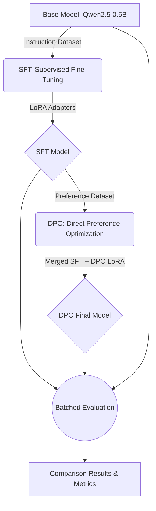

# Qwen2.5-0.5B: Полный пайплайн Fine-Tuning (SFT + DPO)

Данный репозиторий содержит реализацию сквозного процесса дообучения и выравнивания легковесной языковой модели **Qwen2.5-0.5B-Instruct**. Проект охватывает все этапы современной разработки LLM: от подготовки данных до оптимизированного тестирования.

## 🚀 Основные этапы
1. **SFT (Supervised Fine-Tuning)**: Дообучение модели на инструкциях с использованием LoRA и 4-битного квантования (bitsandbytes).
2. **DPO (Direct Preference Optimization)**: Выравнивание модели по предпочтениям человека для повышения качества и стиля ответов.
3. **Оптимизированная оценка**: Пакетное тестирование (batching) всех трех вариантов модели (Base, SFT, DPO) с генерацией сравнительных метрик.

## 📊 Результаты сравнения
Оценка проводилась на независимом наборе из 100 примеров.

| Метрика | BASE | SFT (LoRA) | DPO (Alignment) |
| :--- | :--- | :--- | :--- |
| **ROUGE-1 F1** | 28.1% | **32.5%** | 29.4% |
| **Unique Token Ratio** | 67.0% | 69.1% | **70.3%** |
| **Response Length Ratio** | 0.90x | 0.83x | **0.94x** |

### Анализ:
*   **SFT** показал лучший прирост точного совпадения (ROUGE-1), научив модель фактам и формату.
*   **DPO** улучшил "человечность": ответы стали менее повторяющимися (Unique Tokens) и более оптимальными по длине (Length Ratio).

## 🧬 Технологический стек
*   **Язык**: Python 3.10+
*   **Deep Learning**: PyTorch 2.1+
*   **HuggingFace Экосистема**:
    *   `transformers` (загрузка и работа с моделью)
    *   `peft` (LoRA адаптеры)
    *   `trl` (DPO Trainer, SFT Trainer)
    *   `datasets` (управление данными)
*   **Оптимизация**: `bitsandbytes` (4-bit NF4 загрузка), `accelerate`
*   **Мониторинг**: `Weights & Biases` (WandB)

## 🎨 Схема пайплайна (Mermaid)



## 🏗 Сложность проекта
**Оценка**: 🌟🌟🌟🌟🌟 (Senior / 5 звезд)
*   **Обоснование**: Реализация требует знаний в области RLHF-подобных методов (DPO), техник эффективного использования VRAM (Quantization, LoRA), а также проектирования производительных систем оценки (Batched Inference).

## 🛠 Установка и запуск

1. Склонируйте репозиторий:
   ```bash
   git clone https://github.com/vsanyanov-ux/finetuning-lora-dpo.git
   cd finetuning-lora-dpo
   ```

2. Установите зависимости:
   ```bash
   pip install -r requirements.txt
   ```

3. Запустите пайплайн оценки:
   ```bash
   python full_eval_orchestrator.py
   ```

## 📜 Структура файлов
*   `sft_train.py`: Скрипт дообучения на инструкциях.
*   `dpo_train.py`: Скрипт выравнивания по предпочтениям.
*   `full_eval_orchestrator.py`: Оркестратор для автоматической оценки всех моделей.
*   `evaluate_single.py`: Оптимизированный модуль пакетной оценки.
*   `config.py`: Единая конфигурация всех параметров проекта.

---
*Сделано в рамках изучения современных техник дообучения LLM.*
